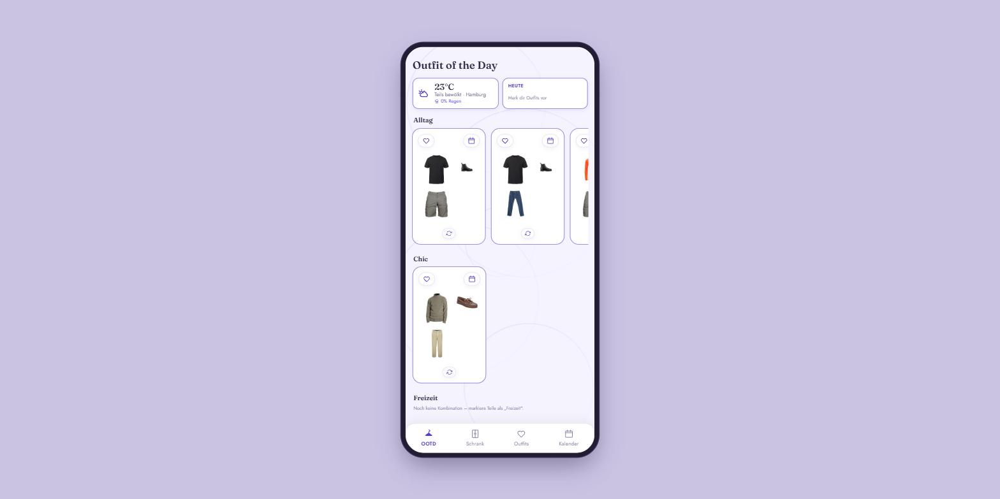
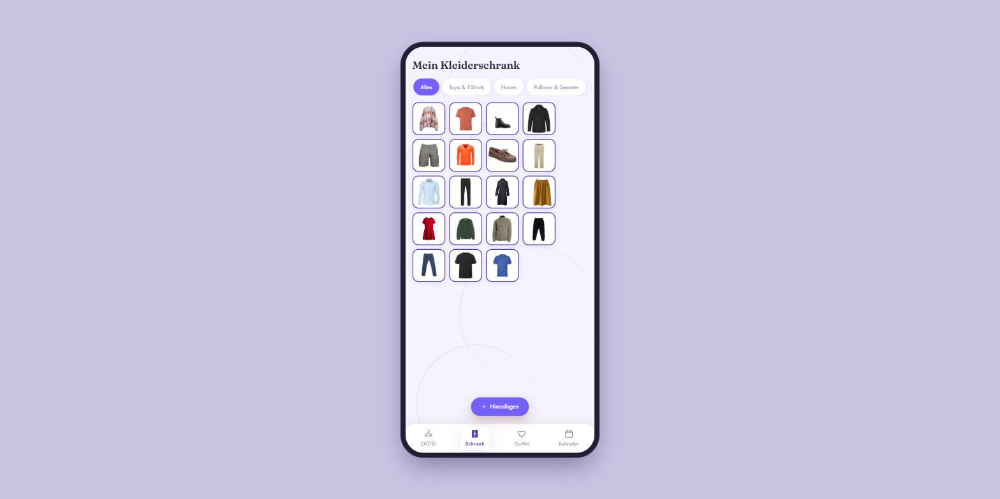
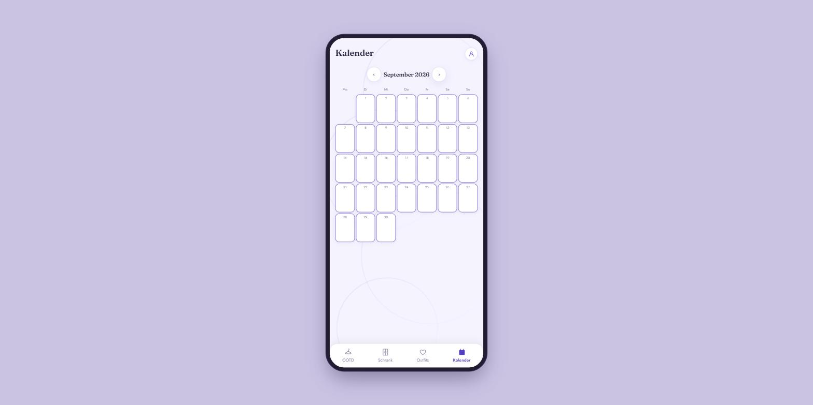

# Kleiderschrank

Ein lokal-first Web-App zum **Digitalisieren des eigenen Kleiderschranks** und für
**tägliche Outfit-Vorschläge**. Alle Daten (Kleidungsstücke, Outfits, Looks,
Kalender) bleiben im Browser (IndexedDB) – kein Server, keine Cloud.

Gebaut mit **Vite + Vanilla JS** (ohne Framework). Auf dem Desktop wird die App
als Smartphone-Mockup dargestellt.

## Screenshots

| Onboarding | Outfit of the Day | Kleiderschrank |
|---|---|---|
|  |  |  |

| Outfits & Favoriten | Kleidung anlegen | Kalender |
|---|---|---|
|  |  |  |

## Features

- **Kleiderschrank digitalisieren** – Fotos hochladen, Hintergrund lokal
  freistellen und mit Kategorie, Farben, Wetter, Anlass, Muster und Passform
  taggen.
- **Outfit of the Day** – drei tägliche Kategorien (Alltag, Chic, Freizeit) mit
  je bis zu drei Vorschlägen, passend zum heutigen Wetter.
- **Deterministisches Outfit-Regelwerk** – Slot-Zuordnung, Wetter- und
  Formalitäts-Filter, Farbharmonie-/Muster-/Wetter-Scoring und Diversitätsregel
  (siehe [`outfit-regelwerk.md`](outfit-regelwerk.md)).
- **Outfit-Builder** – Teile pro Kategorie zusammenklicken, Live-Bewertung.
- **Favoriten & Looks** – Lieblings-Outfits speichern und Fotos getragener
  Outfits ("Looks") hochladen.
- **Kalender** – Outfits/Looks einzelnen Tagen zuordnen.
- **Einstellungen** – Garderobe (Herren/Damen/Gemischt), Temperatureinheit,
  Wetteranzeige und wetterbasierte Vorschläge.
- **Onboarding** bei Erstnutzung.
- Warmes, modernes UI (violettes Theme). Auf Desktop mit Smartphone-Rahmen und
  Drag-to-Scroll.

## Getting Started

```bash
npm install
npm run dev
```

Danach im Browser öffnen (Vite gibt die lokale URL aus, z. B. `http://localhost:5273/`).

Production-Build:

```bash
npm run build
npm run preview
```

## Technik

- **Vite** (Dev-Server & Build), **Vanilla JS**, **CSS-Variablen**.
- **IndexedDB** für Persistenz (Bilder als Blob).
- Offline-tauglich; die einzige Online-Funktion ist das Wetter
  ([Open-Meteo](https://open-meteo.com/), ohne API-Key).
- Kategorie-Baum, Tag-Formular, Outfit-Engine und Views sind in `src/` modular
  aufgeteilt.
